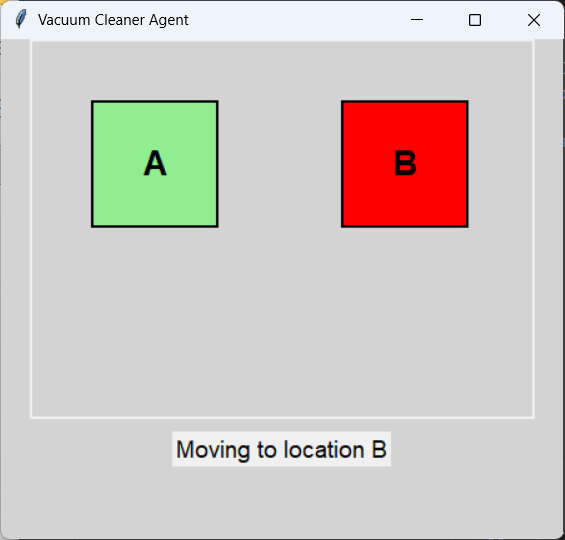

# Vacuum Cleaner Agent Simulation

A simple **Python Tkinter simulation** of a vacuum cleaner agent that moves between two locations and cleans dirty areas automatically.




## Features
- Two locations (A and B) represented as colored squares.
- Click a location to mark it as **Dirty** or **Clean**.
- Automatic movement between locations every few seconds.
- Cleans dirty locations automatically.
- Stop automatic operation by pressing **Spacebar**.

## How to Run
```bash
git clone https://github.com/Imenturki0/vacuum-agent.git
cd vacuum-agent
python vacuum_agent.py
